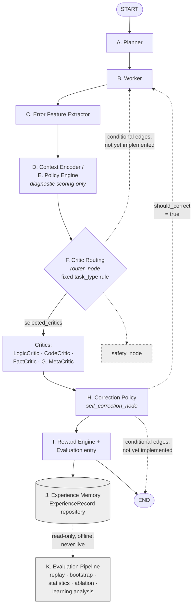
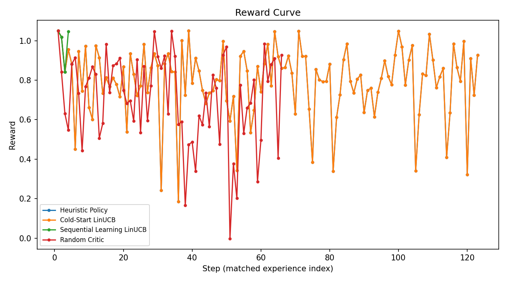

# 3. Methodology

This section describes the design and implementation of the Adaptive
Critic Routing Framework (ACRF) v1.0. ACRF is implemented as a
deterministic state machine, built on LangGraph, in which a shared
execution state is passed through a fixed sequence of nodes. Each node
implements one stage of Algorithm 1 (Adaptive Critic Routing). Every
scoring rule, weight, and threshold described below is a fixed constant
chosen at implementation time; no component of the graph execution path
performs gradient-based learning, and no large language model or
external service call is invoked by any routing, scoring, or evaluation
component. Sequential, in-place policy adaptation exists only as an
explicitly opt-in mode of the offline evaluation pipeline (Section 3.4)
and is never invoked during graph execution.

## 3.1 Overall Architecture

ACRF is organized as a `StateGraph` over a single shared data structure,
`AgentState`, which accumulates the results of each stage as execution
proceeds (Fig. 1). Every node accepts and returns the same `AgentState`
instance, so the graph is a well-defined function composition over one
consistent state representation. The architecture comprises eleven
functional components, described below in the order data flows through
them.

**A. Planner.** The planner node consumes the incoming user query and
produces a `PlannerOutput` describing a task decomposition. In the
current implementation this decomposition is a deterministic,
rule-based placeholder rather than a learned or LLM-generated plan; its
role in the architecture is to populate the fields (task type,
decomposition steps) that downstream components — most notably the
Context Encoder and the Heuristic Policy — consume as complexity
signals.

**B. Worker.** The worker node consumes the planner's output and
produces a `WorkerOutput` representing an initial system response. As
with the planner, worker generation is a deterministic placeholder;
its output is the artifact that the critic layer subsequently evaluates
and that later worker outputs (following a correction cycle) replace.

**C. Error Feature Extractor.** This node inspects the current
`AgentState` — principally the latest worker output and any prior
critic feedback — and derives a structured `ErrorFeatureProfile`
describing task complexity, confidence, and escalation flags
(`requires_self_correction`, `requires_meta_critic`). This profile is
the primary structured signal consumed by the Context Encoder and by
the Heuristic Policy's scoring function.

**D. Context Encoder.** The Context Encoder converts the current
`AgentState` into a fixed-length, named numeric feature vector (a
`ContextVector`), independent of any specific policy or downstream
consumer. Section 3.2 describes its feature set and normalization in
full.

**E. Policy Engine.** The policy engine node builds a `ContextVector`
for the current state and delegates critic scoring, ranking, and
selection to a pluggable policy object implementing a common interface.
Section 3.3 describes the two implemented policies (a heuristic scoring
policy and a linear contextual-bandit policy) and the selection process
in full. The policy engine's output is recorded as diagnostic data on
the shared state; it does not, by itself, determine which critics are
executed (see Critic Routing, below).

**F. Critic Routing.** Which critic(s) are actually executed for a
given state is determined by a separate, deliberately simple
deterministic rule: task type `"code"` routes to `CodeCritic`, and
every other task type routes to `LogicCritic`. This routing decision is
architecturally decoupled from the Policy Engine's scoring computation
so that adaptive-policy research (Section 3.3) can be developed,
evaluated, and compared offline without altering the live routing
behavior of the deployed graph. The critics themselves — `LogicCritic`,
`CodeCritic`, `FactCritic`, and `MetaCritic` — are implemented as
placeholder evaluators that each return a fixed, content-independent
`CriticResult`; the framework defines the *routing and aggregation*
architecture around a critic evaluation layer, and this evaluation
layer's internal scoring logic is intentionally left for future
integration of a real evaluator.

**G. Meta Critic.** `MetaCritic` is one of the four built-in critics,
distinguished by its role in the Heuristic Policy's scoring function
(Section 3.3-A): its weight table gives the largest weight to whether
the error-feature profile flags `requires_meta_critic`, together with
iteration and attempt pressure, so that (under the Heuristic Policy)
states exhibiting repeated correction attempts are more likely to be
routed toward meta-level evaluation. As with the other three critics,
its evaluation logic itself is a deterministic placeholder.

**H. Correction Policy.** Following critic execution, a
`CorrectionDecisionEngine` evaluates six independent, pure rule
functions over the current state (low aggregated quality, maximum
iterations reached, meta-critic escalation, a self-correction flag from
the error-feature profile, low memory relevance, and uniformly
high-quality critic scores) and combines their outcomes under a fixed
priority order — a hard stop at the iteration budget, then correction
if any "should correct" rule fires, then a finish signal if every
critic score is high, else a conservative default of no correction.
Only if this decision is affirmative does the self-correction node
apply its (unchanged) placeholder correction: appending a
`CorrectionRecord`, incrementing the iteration counter, and appending a
new worker output.

**I. Reward Engine.** Once execution reaches the evaluation node, a
`RewardCalculator` converts the completed execution's `ExperienceRecord`
into a structured `RewardSignal`. Section 3.5 describes this
computation in full.

**J. Experience Memory.** Every completed execution is recorded as an
`ExperienceRecord` by an `ExperienceRecorder` and persisted through an
`ExperienceRepository` abstraction (an in-memory implementation is
provided; the interface is storage-agnostic). This repository is the
sole data source for the offline evaluation pipeline (Section 3.6): no
component of the live graph reads from it, and no offline evaluation
component writes to it.

**K. Evaluation Pipeline.** Outside the live execution graph, a
separate suite of modules replays recorded experience data to evaluate,
compare, and analyze policies without invoking the graph, a language
model, or any policy's online update mechanism (except where explicitly
enabled, Section 3.4). Sections 3.6 and 3.7 describe this pipeline in
full.

### Complete Workflow

Algorithm 1 summarizes the ten steps traced by the implemented nodes.
Steps 1-3 (Planner, Worker, Error Feature Extractor) produce the
decomposition, initial response, and structured error-feature profile
described above. Steps 4-6 build the candidate critic set, encode the
current state as a context vector, and delegate scoring, ranking, and
selection to the active policy (Policy Engine); this computation is
recorded for traceability but does not itself alter routing. Between
this stage and critic execution, the Critic Routing node (`router_node`)
independently determines `state.selected_critics` via the fixed
task-type rule described above; this node executes at this point in the
graph topology but is not itself one of Algorithm 1's ten numbered
steps. Steps 7-8 (Critic Routing execution and aggregation) then
execute the critics named by `state.selected_critics` and combine their
results through a placeholder aggregation strategy. Step 9 (Correction
Policy) applies the correction decision described above. Step 10
(Evaluation Pipeline entry point) records the completed execution as an
`ExperienceRecord`, computes its `RewardSignal`, and extracts a
standardized `ExecutionMetrics` summary. A dedicated safety node is
declared in the graph interface but is not implemented in v1.0; safety
behavior is out of scope for this methodology.

```
Algorithm 1: Adaptive Critic Routing (ACRF v1.0 execution trace)

Input:  user_query, task_type (optional), max_iterations
Output: final_response, ExperienceRecord, RewardSignal, ExecutionMetrics

 1: state ← AgentState(user_query, task_type, max_iterations)
 2: state.planner_output ← Planner(state.user_query)                       ▷ Step 1 (planner_node)
 3: state.worker_outputs ← state.worker_outputs ∪ { Worker(state) }        ▷ Step 2 (worker_node)
 4: state.error_features ← state.error_features ∪                         ▷ Step 3 (error_feature_extractor_node)
        { ErrorFeatureExtractor(state) }
 5: candidates ← CANDIDATE_CRITIC_NAMES                                    ▷ Step 4 (policy_engine_node)
 6: context ← ContextEncoder.encode(state)                                 ▷ Step 5 (policy_engine_node)
 7: decision ← ActivePolicy.select_action(context, candidates)             ▷ Step 6 (policy_engine_node)
 8: record decision under state.memory_context["policy_engine"]              (diagnostic only — does not set
                                                                                state.selected_critics or route)
 9: state.selected_critics ← RouteByTaskType(state.task_type)              ▷ router_node (not one of the ten
                                                                                numbered steps; sets live routing)
10: for critic in state.selected_critics do                                ▷ Step 7 (critic_node)
11:     state.critic_scores[critic] ← critic.evaluate(latest worker output)
12: end for
13: state.aggregated_quality_score ← MajorityVoteStrategy(state.critic_scores)  ▷ Step 8 (critic_node)
14: decision ← CorrectionDecisionEngine.decide(state)                      ▷ Step 9 (self_correction_node)
15: if decision.should_correct then
16:     state.correction_history ← state.correction_history ∪ { CorrectionRecord(decision) }
17:     state.iteration_count ← state.iteration_count + 1
18:     state.worker_outputs ← state.worker_outputs ∪ { Worker(state) }    ▷ new placeholder attempt
19: end if
20: state.final_response ← latest entry of state.worker_outputs
21: experience ← ExperienceRecorder.record(state)                         ▷ Step 10 (evaluation_node)
22: reward ← RewardCalculator.calculate(experience)                       ▷ Step 10 (evaluation_node)
23: metrics ← MetricsCollector.extract(state, experience, reward)         ▷ Step 10 (evaluation_node)
24: store experience, reward into DEFAULT_EXPERIENCE_REPOSITORY
25: return state.final_response, experience, reward, metrics
```

*Algorithm 1: Adaptive Critic Routing — the single completed pass
(lines 2-24) traced by the nine implemented nodes, corresponding
exactly to the ten numbered steps and the interleaved, unnumbered
Critic Routing step described above. The graph topology (Section 3.1,
Fig. 1) additionally defines conditional branches from `router_node`,
`critic_node`, and `self_correction_node` back to `worker_node`, and
from `self_correction_node`/`safety_node` directly to termination;
selecting among these at runtime is delegated to the conditional-edge
functions in `app/graph/edges.py`, which are declared but not yet
implemented in v1.0, so only the single linear pass shown above has
ever been exercised.*



*Figure 1: ACRF v1.0 architecture and data flow, derived directly from
`app/graph/state_graph.py`'s declared topology and the eleven
functional components (A-K) described above. Solid arrows are the
graph's fixed edges, always traversed in the order shown; the labeled
arrow out of Critic Routing is the one routing decision the framework
currently makes (a fixed task-type rule), not a learned or adaptive
one. Dashed arrows are conditional edges `app/graph/state_graph.py`
declares in the topology (`ROUTER_PATH_MAP`, `CRITIC_PATH_MAP`,
`SELF_CORRECTION_PATH_MAP`, `SAFETY_PATH_MAP` in `app/graph/edges.py`)
whose selection logic is not yet implemented, so they have not been
exercised in v1.0; `safety_node` itself is declared but unimplemented
(shaded). Experience Memory (J) and the Evaluation Pipeline (K) sit
outside the live graph entirely, connected by one read-only arrow —
the architectural decoupling this methodology relies on throughout.*

## 3.2 Context Representation

### Context Features

The live Context Encoder derives twenty-seven named numeric features
from `AgentState`, organized into two groups. The first group (eighteen
features) captures general execution-progress signals: iteration count
and ratio, counts of error features, worker outputs, critic scores,
selected critics, retrieved memories, and correction-history entries;
the aggregated quality score and its presence flag; ordinal codes for
safety and execution status; task-type indicators; and summary
statistics (mean, maximum, minimum) over recorded critic scores. The
second group (nine features — `uncertainty`, `risk`, `task_complexity`,
`memory_relevance`, `requires_self_correction`, `requires_meta_critic`,
`is_code_output`, `iteration_pressure`, `attempt_pressure`) is
constructed to be numerically identical to the input features consumed
by the Heuristic Policy's scoring function (Section 3.3-A), so that a
policy operating purely on the context vector reproduces the same
scores as one operating directly on `AgentState`. A separate,
independent feature-extraction function is used when building context
vectors from stored `ExperienceRecord`s during offline evaluation
(Section 3.4), since a stored record does not retain a live
`AgentState`; this offline builder derives four features restricted to
state signals verified invariant across a whole recorded episode — a
task-type indicator, a task-type-presence flag, a plan-complexity score
derived from the planner's task decomposition, and the iteration budget
(`max_iterations`) — deliberately excluding every `ExperienceRecord`
field that reflects the episode's outcome, the action actually taken, or
a count that can change across an episode's later iterations, and is
deliberately kept independent of the live encoder.

### Context Vector

A context vector is represented as an immutable structured record
comprising: a deterministic identifier derived from its source; the
named feature values, as a mapping; an explicit, stable feature
ordering (so a fixed-width numeric array can be constructed
independently of mapping-iteration order); a source timestamp; a flag
and strategy identifier recording whether normalization has been
applied; and a metadata mapping for auxiliary, non-decision data (for
example, outcome-derived signals that must not be mistaken for
information available before an outcome is known).

### Feature Normalization

Normalization rescales every feature into a fixed range using a
per-feature lower and upper bound table fixed at implementation time
(rather than bounds fitted from data). For a feature value $x$ with
bounds $[x_{\min}, x_{\max}]$, the normalized value is

$$
x' = \mathrm{clip}\!\left(\frac{x - x_{\min}}{x_{\max} - x_{\min}},\; 0,\; 1\right). \tag{1}
$$

Normalization produces a new context vector rather than mutating the
original, preserving the immutability of previously computed contexts.

## 3.3 Adaptive Critic Routing

Two policies are implemented against a common abstract interface,
`select_action(context, candidate_critics) \rightarrow$ decision`,
together with a stub reserving a future contextual-bandit
implementation, and a registry mapping policy names to instances.

### A. Heuristic Policy

The Heuristic Policy scores each candidate critic $c$ as a fixed linear
combination of nine extracted state features
$\mathbf{f} = (f_1, \dots, f_9)$:

$$
s_c = \mathrm{clip}\!\left(w_{c,0} + \sum_{i=1}^{9} w_{c,i}\, f_i,\; 0,\; 1\right), \tag{2}
$$

where $w_{c,0}$ is a fixed per-critic base term and $w_{c,i}$ are fixed
per-critic feature weights (Table 1), each critic's weights (including
the base term) summing to one so that, with every feature bounded in
$[0,1]$, $s_c$ is always in $[0,1]$ without requiring the clip in
practice. Weights differ by critic: for example, `LogicCritic`
emphasizes uncertainty, risk, and task complexity; `CodeCritic`
emphasizes whether the worker output is code and task complexity;
`FactCritic` emphasizes memory relevance and uncertainty; and
`MetaCritic` emphasizes the `requires_meta_critic` flag together with
iteration and attempt pressure. A fixed default weight table is applied
to any candidate critic name not present in this table. Candidates are
then ordered by score (ties broken alphabetically by critic name) and
the top-ranked candidate is selected under the framework's default
selection strategy; top-$k$ and threshold-based selection strategies are
also implemented and available to a caller.

| Critic | $w_0$ (base) | uncertainty | risk | task_complexity | memory_relevance | requires_self_correction | requires_meta_critic | is_code_output | iteration_pressure | attempt_pressure | Sum |
|---|---|---|---|---|---|---|---|---|---|---|---|
| `LogicCritic` | 0.10 | 0.35 | 0.25 | 0.30 | — | — | — | — | — | — | 1.00 |
| `CodeCritic` | 0.10 | — | 0.15 | 0.25 | — | — | — | 0.50 | — | — | 1.00 |
| `FactCritic` | 0.10 | 0.30 | 0.20 | — | 0.40 | — | — | — | — | — | 1.00 |
| `MetaCritic` | 0.00 | — | 0.10 | — | — | 0.15 | 0.35 | — | 0.25 | 0.15 | 1.00 |
| Default (unrecognized critic name) | 0.00 | 0.25 | 0.25 | 0.20 | 0.10 | 0.10 | 0.10 | — | — | — | 1.00 |

*Table 1: Per-critic feature weights used by the Heuristic Policy,
transcribed directly from `app/policy_engine/scorer.py`'s
`_CRITIC_WEIGHTS` and `_DEFAULT_WEIGHTS` constants. An em dash denotes
a weight of 0 (the feature does not contribute to that critic's score).
Every row sums to 1.00, confirming equation (2)'s stated property that
$s_c \in [0,1]$ for any feature vector bounded in $[0,1]$ without the
clip binding in practice.*

### B. LinUCB Policy

The LinUCB Policy implements the disjoint (per-arm) linear upper
confidence bound algorithm for contextual bandits. Each candidate
critic is modeled as an independent arm $a$, maintaining a $d \times d$
design matrix $A_a$ (initialized to $\lambda I$ for a fixed
regularization constant $\lambda$), its inverse $A_a^{-1}$, and a
response vector $b_a \in \mathbb{R}^d$ (initialized to $\mathbf{0}$),
where $d$ is the dimensionality of the context feature vector. Given a
context vector $x \in \mathbb{R}^d$, arm $a$'s predicted value is

$$
\theta_a = A_a^{-1} b_a, \qquad
p_a(x) = \theta_a^{\top} x + \alpha \sqrt{x^{\top} A_a^{-1} x}, \tag{3}
$$

where $\alpha \geq 0$ is a fixed exploration coefficient. The first term
is the ridge-regression point estimate of expected reward; the second
is an exploration bonus proportional to the model's uncertainty about
$x$ under arm $a$. The candidate with the highest $p_a(x)$ is selected,
with ties broken alphabetically by action name for determinism.

Given an observed $(x, r)$ pair for arm $a$, its statistics update as

$$
A_a \leftarrow A_a + x x^{\top}, \qquad b_a \leftarrow b_a + r x. \tag{4}
$$

Rather than recomputing $A_a^{-1}$ by explicit matrix inversion after
every update, $A_a^{-1}$ is maintained incrementally via the
Sherman-Morrison identity:

$$
A_a^{-1} \leftarrow A_a^{-1} - \frac{(A_a^{-1} x)(A_a^{-1} x)^{\top}}{1 + x^{\top} A_a^{-1} x}. \tag{5}
$$

Because $A_a$ is positive definite by construction and a rank-one
update of the form $x x^{\top}$ preserves positive definiteness, the
denominator in (5) is always at least one, so this update is
numerically well-defined for every observation; $A_a^{-1}$ is
additionally re-symmetrized after each update to control floating-point
drift. In v1.0, no policy is updated during graph execution or during
the standard (non-learning) offline evaluation path; Section 3.4
describes the one evaluation mode in which (4)-(5) are actually
invoked.

### C. Policy Selection Process

Both policies conform to the same abstract interface and return a
structured decision object recording the selected critic(s), the full
per-candidate score mapping, an explicit ranking, a policy name and
version, a confidence value, and auxiliary metadata. A policy registry
maps policy names to instances and designates one as the default,
allowing the policy engine node to retrieve "the current policy" by
name rather than importing a specific policy class. This layer is
exercised by the policy engine node (Section 3.1-E) for diagnostic
scoring and by the offline evaluation pipeline (Section 3.6) for policy
comparison; it is architecturally independent of, and does not
override, the fixed rule that determines live critic routing (Section
3.1-F).

## 3.4 Sequential Replay Learning

### Offline Replay

Offline replay implements the *replay method* for unbiased off-policy
evaluation of logged contextual-bandit feedback [12]. For each stored
`ExperienceRecord`, a context vector is built (Section 3.2) and the
policy under evaluation selects an action from a fixed candidate set.
If the policy's selection exactly matches (as a set) the critic(s)
actually recorded for that experience, the experience's already-known
outcome is a valid, unbiased sample of what would have happened under
this policy, and its reward is computed via the Reward Engine
(Section 3.5) and recorded. If the policy would have selected
differently, the experience is skipped: its outcome under an action
that was never actually taken is unknown, and estimating it would bias
the evaluation.

### Match-Gated Learning

This same matching predicate — the policy's live selection must equal
the historically recorded selection — governs which experiences may
ever be used as a training signal, in both the standard and the
sequential-learning replay modes. This is a deliberate design
constraint: because offline replay never observes the reward of an
action it did not take, using an unmatched experience to update a
policy would require fabricating a counterfactual reward, which would
compromise the correctness guarantee the replay method is intended to
provide. Consequently, only matched experiences ever contribute a
training signal, whether for evaluation (accumulated into aggregate
statistics) or for learning (used to update policy state).

### Policy Update Process

A second, explicitly named replay method processes the same matched
experiences sequentially and, for every match, immediately applies
equations (4)-(5) to the policy before continuing to the next
experience, in the order experiences are stored:

1. Build the context vector for the next experience and query the
   policy for its current selection.
2. If the selection does not match the recorded critic(s), skip to the
   next experience.
3. Otherwise, compute the experience's reward via the Reward Engine.
4. Apply the policy's update rule — equations (4)-(5) for the LinUCB
   Policy — using the observed context, action, and reward.
5. Continue to the next experience under the policy's now-updated
   state.

Because the policy's internal state changes between iterations, the
outcome of this process depends on the order in which experiences are
processed, and a later experience in the same call is evaluated against
whatever the policy has already learned from earlier experiences in
that call — in contrast to standard replay, in which every experience
is evaluated against one fixed, unchanging policy state throughout.

### Rationale for Introducing a Second Method

The sequential-learning replay method was implemented as an additional
method on the same replay component, leaving the original,
non-learning replay method completely unmodified, for three reasons.
First, every existing consumer of standard replay — the bootstrap
evaluation, benchmarking, statistical-comparison, and ablation
components described in Section 3.6 — depends on the guarantee that
replaying a policy never changes it; introducing learning as a new,
separately named method rather than as a parameter of the existing
method makes it possible to verify, by inspection and by regression
testing, that this guarantee continues to hold for every existing
caller. Second, keeping both methods on the same component, sharing the
same repository, matching rule, and reward computation, allows the two
evaluation regimes to be run side by side, from the same starting
policy state, over the same data, so that a policy's out-of-the-box
behavior and its behavior after sequential training can be directly
compared (Section 3.7). Third, restricting learning to a single,
explicitly named entry point makes every location in the codebase that
can modify policy state through replay identifiable by a single method
name, rather than requiring inspection of call-site arguments.

## 3.5 Reward Function

### Reward Definition

The Reward Engine converts a completed `ExperienceRecord` into a
structured `RewardSignal` comprising five independently computed,
bounded components — a quality reward, a completion bonus, a cost
penalty, a latency penalty, and a correction penalty — together with a
reported (non-additive) efficiency-penalty sum and a confidence value
reflecting how many of the record's optional signals were present. The
reward computation is implemented behind an abstract strategy
interface; the framework's default strategy is described below, and an
alternative, quality-only strategy is also implemented for ablation
analysis (Section 3.6).

### Weighted Reward

The default strategy computes total reward as

$$
R = q + b - p_{\text{cost}} - p_{\text{lat}} - p_{\text{corr}}, \tag{6}
$$

where $q$ is the quality reward, $b$ is the completion bonus, and
$p_{\text{cost}}$, $p_{\text{lat}}$, and $p_{\text{corr}}$ are the cost,
latency, and correction penalties, each defined below.

### Quality

$$
q = \mathrm{clip}(\hat{q},\, 0,\, 1) \cdot w_q, \tag{7}
$$

where $\hat{q}$ is the experience's aggregated quality score and $w_q$
is a fixed weight (unity in the default strategy); a missing quality
score contributes zero rather than raising an error.

### Latency

$$
p_{\text{lat}} = \min\big(p_{\text{lat}}^{\max},\, \max(0, \ell) \cdot s_{\text{lat}}\big), \tag{8}
$$

where $\ell$ is the recorded latency, $s_{\text{lat}}$ is a fixed scale
constant, and $p_{\text{lat}}^{\max}$ is a fixed upper bound; a missing
latency contributes zero. The cost penalty $p_{\text{cost}}$ is defined
analogously from the experience's estimated cost, with its own fixed
scale and upper bound.

### Iteration (Correction) Penalty

$$
p_{\text{corr}} = \min\big(p_{\text{corr}}^{\max},\, n \cdot c\big), \tag{9}
$$

where $n$ is the number of correction iterations recorded for the
experience, $c$ is a fixed per-iteration penalty, and
$p_{\text{corr}}^{\max}$ is a fixed upper bound; a non-positive
iteration count contributes zero.

### Completion Bonus

The completion bonus $b$ is a fixed positive constant when the
experience's terminal execution status is "completed," a fixed negative
constant when it is "failed," and zero for any other status. All
constants in (7)-(9) and the completion bonus are fixed at
implementation time and are not fitted, learned, or randomized; the
same experience always yields the same reward.

## 3.6 Evaluation Framework

The evaluation framework is a suite of modules, entirely separate from
the live execution graph, that read only from the Experience Memory
(Section 3.1-J) and never invoke a language model, the graph, or (with
the one exception in Section 3.4) a policy's update method.

### Offline Replay

The offline replay component (Section 3.4) and its companion aggregator
form the basis of every higher-level evaluation described below: the
aggregator folds one policy's matched replay steps into a single result
recording total and average reward, average quality, average
iterations, average latency, per-critic selection frequency, and the
match rate (the fraction of stored experiences that were matched).

### Bootstrap Evaluation

To obtain more than a single point estimate from one fixed experience
log, an experiment runner draws $N$ independent bootstrap resamples
(sampling stored experiences with replacement, so each resample has the
same size as the source log) and replays a freshly constructed policy
instance against each resample independently, aggregating the $N$
per-resample results into one summary. A single run ($N=1$) instead
replays the source log directly, with no resampling. This procedure
requires no change to the replay component itself; a purpose-built,
duplicate-tolerant experience-repository implementation represents each
resample, since a bootstrap draw legitimately selects the same stored
experience more than once.

### Statistical Analysis

Given two policies' per-run average-reward sequences from the procedure
above, a statistical-comparison component computes a paired hypothesis
test, automatically selecting between a paired $t$-test and a Wilcoxon
signed-rank test on the basis of a Shapiro-Wilk normality test applied
to the paired differences: the paired $t$-test is used when normality
is not rejected, and the Wilcoxon signed-rank test is used otherwise
(including when there are too few observations for the normality test
to be computed at all). Two further cases are handled explicitly before
this decision is reached: a single paired observation, for which no
test is meaningful, and the case in which every paired difference is
identical (zero variance), which is resolved analytically rather than
by invoking either test.

### Confidence Intervals

Two distinct confidence-interval computations are implemented, serving
different purposes. For describing a single policy's own reward
distribution across bootstrap runs, an empirical percentile interval is
used: the interval bounds are the $100 \cdot \tfrac{\gamma}{2}$ and
$100 \cdot (1 - \tfrac{\gamma}{2})$ percentiles of the per-run values,
for confidence level $1-\gamma$ (95% by default), an assumption-free
method appropriate to bootstrap-resampled values. For the mean
*difference* between two paired policies, a $t$-distribution interval is
used:

$$
\bar{d} \pm t_{n-1,\,1-\gamma/2} \cdot \frac{s_d}{\sqrt{n}}, \tag{10}
$$

where $\bar{d}$ and $s_d$ are the sample mean and standard deviation of
the $n$ paired differences and $t_{n-1,\,1-\gamma/2}$ is the
corresponding critical value of the $t$-distribution with $n-1$ degrees
of freedom. This interval is reported regardless of which hypothesis
test was selected, providing one consistent, standard interval for the
point estimate.

### Effect Size

Effect size is reported as Cohen's $d$ for paired samples,

$$
d_z = \frac{\bar{d}}{s_d}, \tag{11}
$$

the mean paired difference standardized by the standard deviation of
the differences themselves, the conventional choice for a matched-pairs
design.

### Ablation Studies

An ablation runner composes the components above to realize seven
configurable comparisons against a baseline policy configuration
without modifying any of them: no-exploration LinUCB ($\alpha=0$), an
exploration-coefficient ($\alpha$) sweep, uniformly random critic
selection, heuristic-only routing, LinUCB-only routing, a
reduced-context-feature variant (retaining a configurable fraction of
the context vector's named features before scoring), and an
alternative, quality-only reward definition. Each comparison replays a
baseline and a candidate configuration under identical bootstrap
settings and reduces the resulting pair of results to four reported
differences (reward, quality, latency, and iteration count) together
with a designated winner, computed by the same benchmarking component
used for direct two-policy comparisons, and the paired statistical test
described above.

## 3.7 Learning Analysis

The learning analysis component computes derived metrics from a
completed sequence of replay steps — most meaningfully, the output of
the sequential-learning replay method (Section 3.4) — without accessing
the replay component, any policy, or the experience repository directly.

### Learning Curves

A learning curve is a structured record of index-aligned, per-step
series: the reward observed at each step, its running cumulative sum,
per-step and cumulative regret, and a trailing moving average, together
with a set of scalar summary metrics.

### Cumulative Reward

Cumulative reward at step $i$ is the running sum of per-step rewards,

$$
C_i = \sum_{j=1}^{i} r_j. \tag{12}
$$

### Regret and Cumulative Regret

Because offline replay never observes the reward of an action it did
not take, the true counterfactual optimum at each step is not
recoverable from replay data alone. Instantaneous regret is therefore
defined relative to the best reward actually observed anywhere in the
completed sequence,

$$
\rho_i = \max_j(r_j) - r_i \; \geq 0, \tag{13}
$$

and cumulative regret is its running sum, which is by construction
monotonically non-decreasing. This is a retrospective (hindsight)
regret measure, appropriate for analyzing an already-completed
sequence, as distinct from a causal, online regret measure computed
only from rewards observed up to (rather than across) each step.

### Moving Average Reward

The moving average at step $i$ uses a trailing window of fixed size
$w$, shrinking near the start of the sequence rather than being
undefined there:

$$
M_i = \frac{1}{\min(i, w)} \sum_{j = \max(1,\, i-w+1)}^{i} r_j. \tag{14}
$$

### Convergence Analysis

The convergence step is defined as the smallest index from which the
moving-average series never again departs from a tolerance band around
its own final value, that band being a fixed fraction of the series'
observed range. A companion scalar, the learning-rate estimate, is
computed as the ordinary-least-squares slope of per-step reward against
step index, summarizing whether reward tended to rise, fall, or remain
flat over the analyzed sequence. Both quantities are computed from a
single completed sequence and require no additional replay or policy
access.



*Figure 2: A representative learning-curve output — per-step reward
(equation 12's summand) for the Heuristic Policy, Cold-Start LinUCB
($\alpha=1.0$), Sequential Learning LinUCB ($\alpha=1.0$), and Random
Critic configurations over one deterministic replay pass each. Shown
here to illustrate, at the point this component is introduced, the raw
per-step series that Cumulative Reward (equation 12), Instantaneous and
Cumulative Regret (equation 13), and Moving Average Reward (equation
14) are each derived from; the same figure and underlying data are
presented in full analytical context as Figure 3 in Section 5.2, and
the corresponding cumulative-reward, regret, and moving-average series
computed from it appear as Figures 4-7.*

## Summary

ACRF v1.0 is implemented as a deterministic LangGraph state machine in
which planning, worker generation, error-feature extraction, and
critic execution are governed by fixed, rule-based placeholders, while
critic *routing* is additionally instrumented — but not yet
controlled — by a pluggable policy layer offering a heuristic linear
scorer and a disjoint LinUCB contextual-bandit implementation, evaluated
through a numeric context representation shared by both. Policy
comparison, ablation analysis, and learning-curve characterization are
implemented entirely within an offline evaluation pipeline that
replays previously recorded execution data; this pipeline reproduces
results deterministically, computes standard paired statistical
comparisons with corresponding confidence intervals and effect sizes,
and offers one explicitly separate, optional mode in which a policy is
trained sequentially from replayed data, distinct from every other
evaluation mode in the framework, which never modifies policy state.
